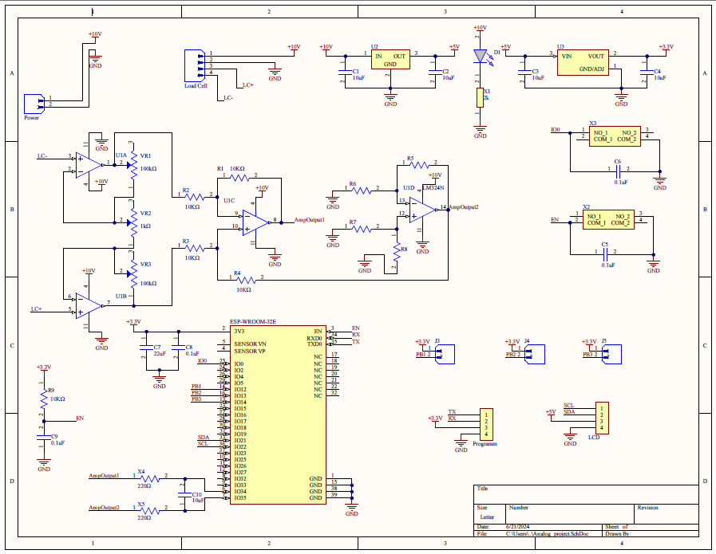
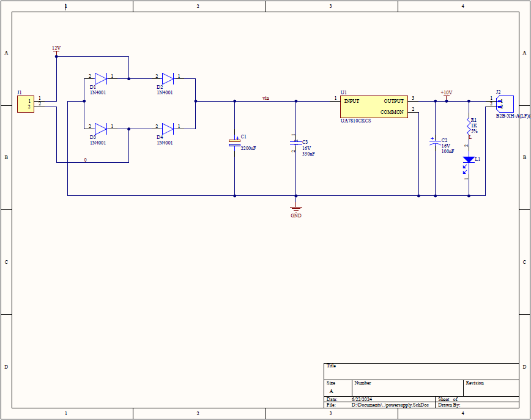

# Analog Weighing Scale Using Load Cell

## Overview

This project is an implementation of an analog weighing scale using a load cell and an amplification circuit with operational amplifiers (opamps). The goal is to measure weight with high accuracy and convert the load cell's analog signal into a readable format.

## Table of Contents

- [Introduction](#introduction)
- [Components](#components)
- [Circuit Diagram](#circuit-diagram)
- [Working Principle](#working-principle)
- [Setup and Installation](#setup-and-installation)
- [Usage](#usage)

## Introduction

This project demonstrates how to design and build an analog weighing scale using a load cell and an opamp-based amplification circuit. The load cell is a type of sensor that converts a force into an electrical signal. In this project, we use operational amplifiers to amplify the small electrical signals generated by the load cell for accurate weight measurement.

## Components

- Load Cell
- lm324N Operational Amplifiers (Opamps)
- Resistors
- Capacitors
- Printed Circuit Board with Power supply (Designed by ourselves)
- ESP WROOM 32E Microcontroller
- Printed Circuit Board with Amplifiying part and the Microcontroller (Designed by ourselves)
- 230V AC to 12V AC Transformer
- Connecting Wires
- LCD Display

## Circuit Diagrams

*Description of the circuit diagram:*
- Outputs of the load cell is connected to the pcb.
- Then output difference voltage connects to inputs of instrumentation amplifier circuit.
- The amplified signal is directly connects to the ADC of the microcontroller.

## Working Principle

1. **Load Cell**: The load cell deforms slightly when a force is applied, changing the resistance of strain gauges inside the cell.
2. **Wheatstone Bridge**: The load cell is wired in a Wheatstone bridge configuration, which outputs a small differential voltage proportional to the applied weight.
3. **Amplification**: The differential voltage from the load cell is very small, so it is amplified using an opamp-based differential amplifier circuit.For to be more precise and efficient we use a instrumentation amplifier circuit.
4. **Output**: The amplified signal can be read using an analog-to-digital converter (ADC), for this we use 12 bit ADC of the microcontroller.

## Setup and Installation

1. **Assemble the Circuit**: Follow the provided circuit diagram to connect the load cell, opamps, and other components.
2. **Power Up**: Connect the power supply to the circuit.
3. **Calibration**: Calibrate the load cell and amplifier circuit using known weights to ensure accuracy.
4. **Read Output**: Connect the output to an ADC if using a microcontroller, or read the output directly on an analog meter.

## Usage

1. **Place Weight**: Place the object to be weighed on the load cell.
2. **Read Measurement**: Observe the amplified signal on the analog meter or read the digital value from the microcontroller's display.

---

Feel free to customize this template according to your project's specific details and requirements. If you have any images, diagrams, or additional resources, make sure to include links or embed them appropriately.
